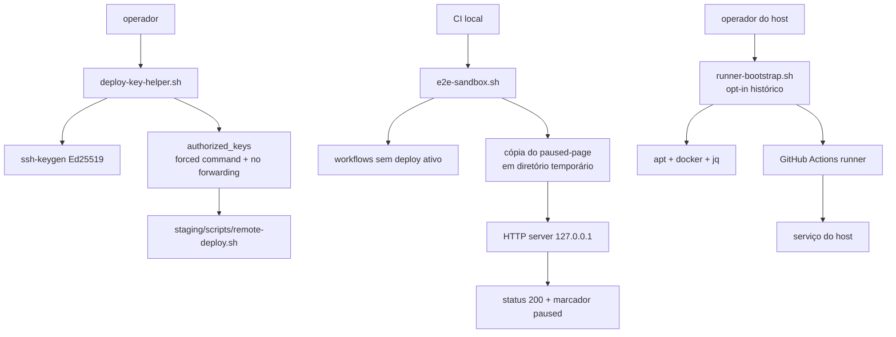

# Callgraph: Bash Ops

## Limites

- A chave restringe o comando, mas não substitui revisão do script remoto.
- O sandbox prova apenas o artefato HTTP local; ele não prova o Swarm, registry
  ou DNS.
- O bootstrap instala software em um host e, por isso, não é uma etapa de CI
  automática.
