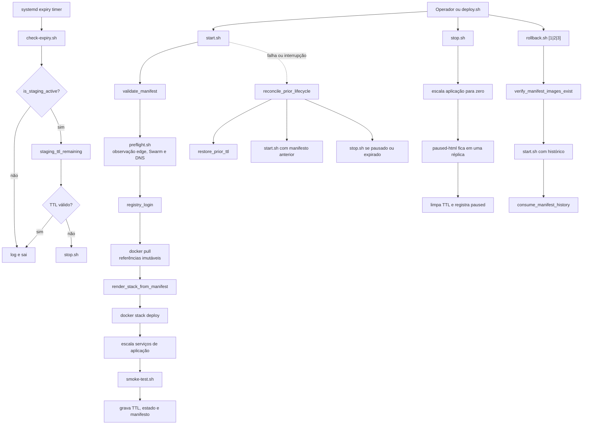
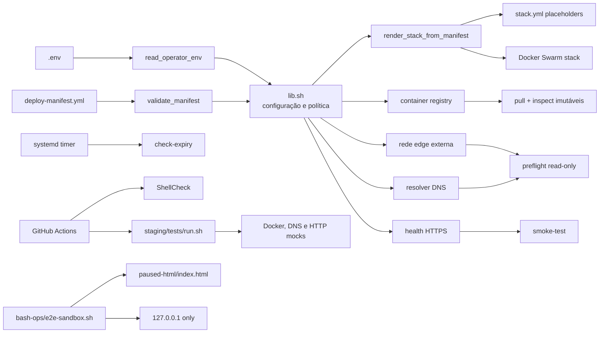
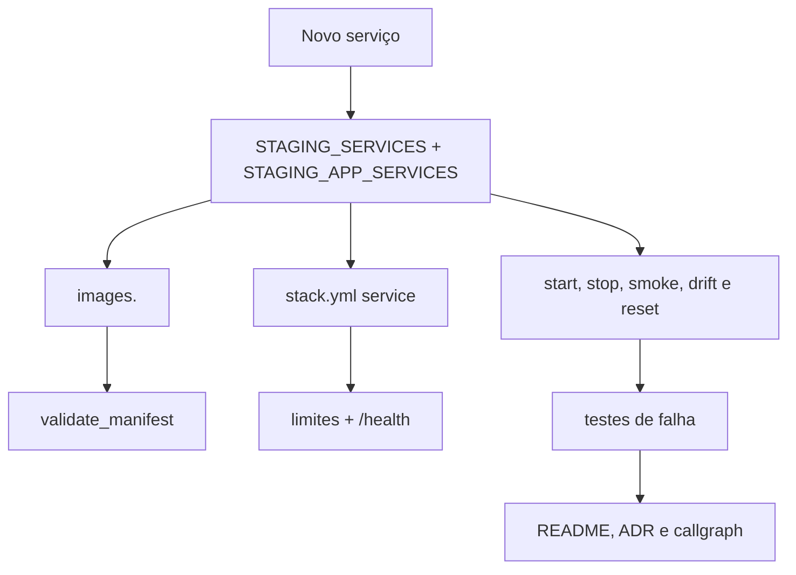

# Callgraphs Mermaid

## Ciclo principal

## Fronteiras externas

## Extensão

Uma extensão que aparece só no template não é deployável; ela precisa cruzar
todos os contratos relevantes e ter teste e documentação.
