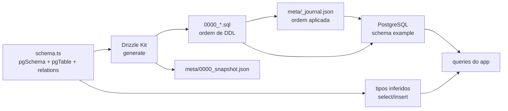

# Callgraph: Drizzle schema e migração

## Contratos que o gráfico torna visíveis

- O SQL é o caminho de escrita no banco; o TypeScript não substitui a
  migração.
- O snapshot e o journal são metadata gerada, não uma segunda fonte manual de
  verdade.
- A aplicação só deve receber a conexão por configuração server-only.
- O schema público mostra estrutura, não dados, credenciais ou endpoints vivos.
