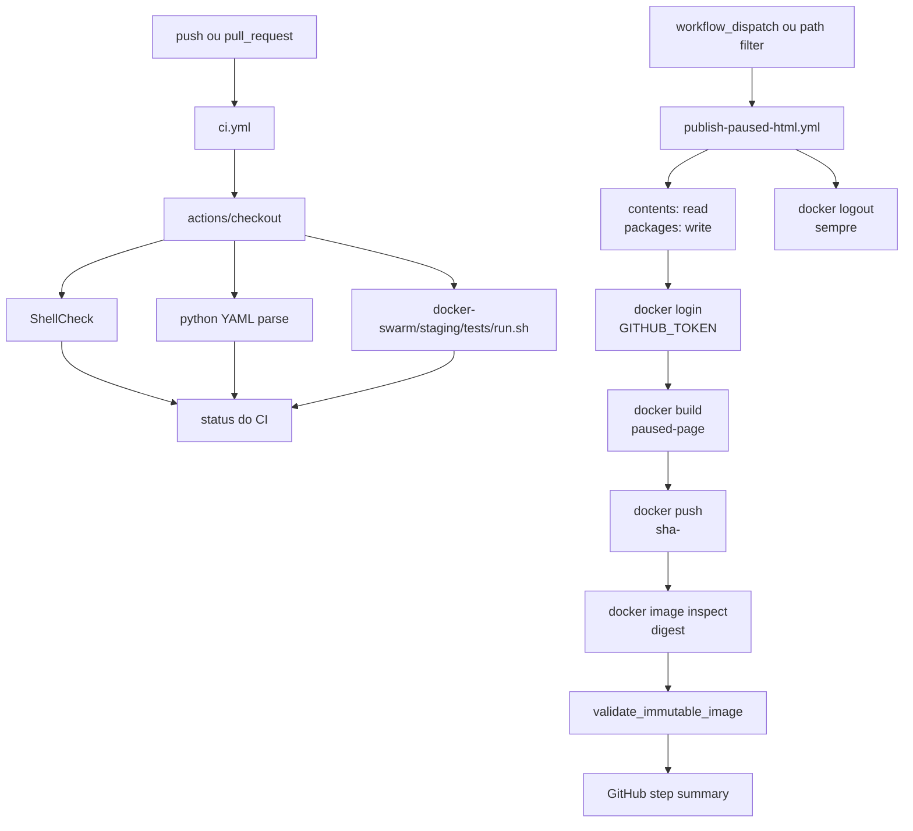

# Callgraph: GitHub Actions

```mermaid
flowchart TD
    push["push ou pull_request"] --> ci["ci.yml"]
    ci --> checkout["actions/checkout"]
    checkout --> shellcheck["ShellCheck"]
    checkout --> yaml["python YAML parse"]
    checkout --> tests["docker-swarm/staging/tests/run.sh"]
    shellcheck --> result["status do CI"]
    yaml --> result
    tests --> result

    dispatch["workflow_dispatch ou path filter"] --> publish["publish-paused-html.yml"]
    publish --> permission["contents: read\npackages: write"]
    permission --> login["docker login\nGITHUB_TOKEN"]
    login --> build["docker build\npaused-page"]
    build --> pushImage["docker push\nsha-<commit>"]
    pushImage --> inspect["docker image inspect\ndigest"]
    inspect --> validate["validate_immutable_image"]
    validate --> summary["GitHub step summary"]
    publish --> logout["docker logout\nsempre"]
```

O gráfico mostra o limite principal: CI verifica o contrato; publicação
produz uma referência imutável; nenhum caminho chama `docker stack deploy`.
