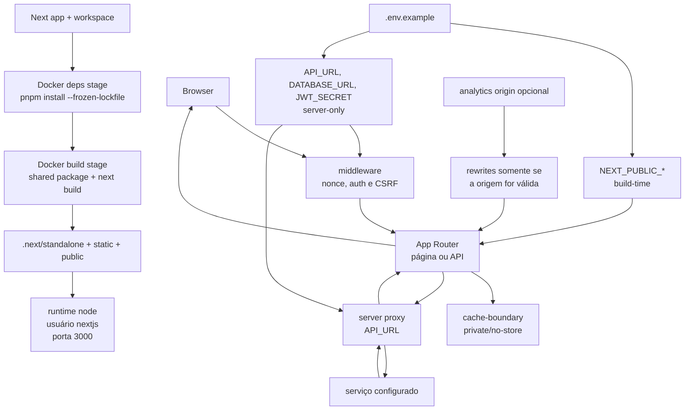

# Callgraph: Next.js build e request boundary

## Leitura

- `Dockerfile` define a fronteira entre dependências de build e runtime.
- `next.config.ts` centraliza headers, redirects, rewrites e a saída standalone.
- `cache-boundary.ts` é a fonte de verdade para rotas privadas; não espalhe
  strings de `Cache-Control` por componentes.
- A API é uma dependência externa. Este exemplo mostra o ponto de entrada, mas
  não embute contrato, credencial ou host de um serviço vivo.
