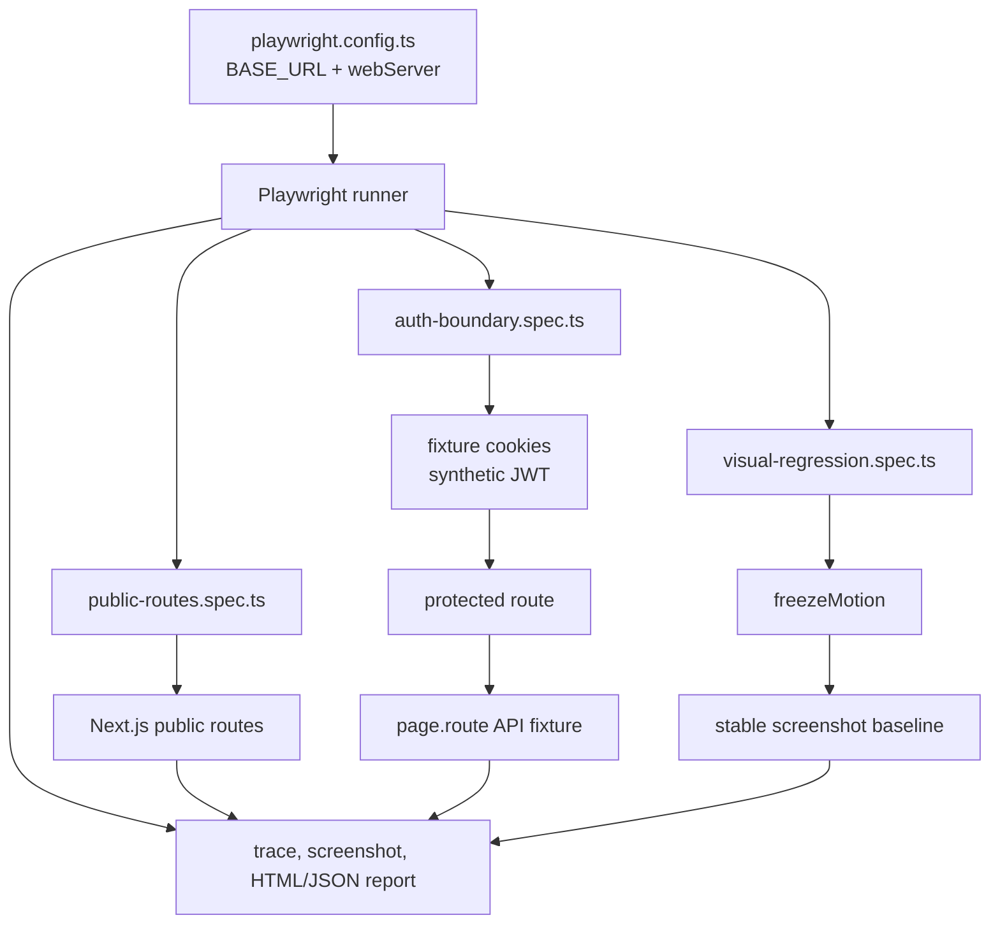

# Callgraph: Playwright E2E

## Fronteiras

- O navegador é o observador; não há acesso a credenciais reais.
- O mock da API fica explicitamente separado do teste de rota pública.
- A evidência de falha é um artefato local do runner, não um upload para um
  serviço externo.
