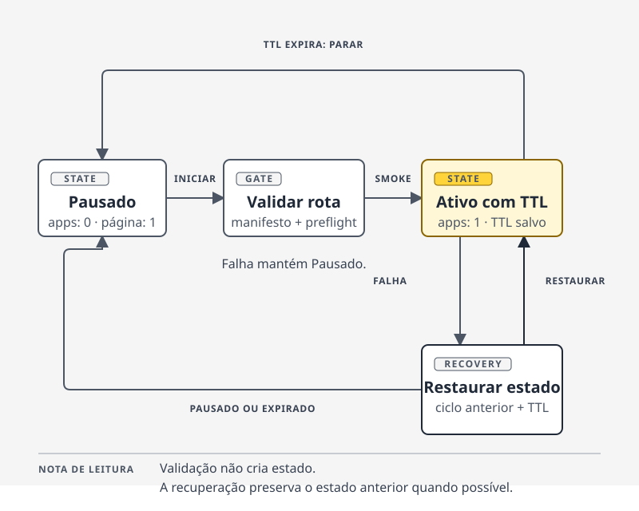

# Janela de staging limitada e recuperação explícita

> **Pergunta:** como abrir uma janela temporária de staging sem deixá-la ativa
> por esquecimento ou trocar uma parada de aplicação por uma resposta ambígua?

## Em uma frase

**Decisão:** o módulo trata pausa, expiração e recuperação como estados
explícitos. Um manifesto imutável entra antes da stack, o preflight observa o
ambiente sem mudá-lo, a aplicação pode ir a zero enquanto a página pausada fica
acessível, e uma falha tenta restaurar o ciclo anterior.

[Ver fontes e limites deste enunciado.](source-map.md#decisoes-e-ciclo-de-vida)

## A situação

Uma janela temporária pode continuar ativa além do necessário. Ela também pode
parar a aplicação e deixar o domínio sem uma resposta clara. O módulo usa uma
página pausada, um TTL e comandos de ciclo de vida para tornar esses estados
visíveis.

**Fonte pública:** [README do Docker Swarm](../../docker-swarm/README.md#porquês)
· [arquitetura](../../docker-swarm/docs/architecture.md)

## O que não pode mudar por acidente

| Restrição | Estado da evidência | Fonte pública |
| --- | --- | --- |
| A stack recebe referências imutáveis pelo manifesto, não imagens prontas no template. | **Decisão** | [README](../../docker-swarm/README.md#porquês) · [validador](../../docker-swarm/staging/scripts/lib.sh) |
| Preflight consulta edge, Swarm e DNS antes do deploy; ele não administra a rede edge. | **Decisão** | [arquitetura](../../docker-swarm/docs/architecture.md#fronteiras) · [README](../../docker-swarm/README.md#gotchas) |
| O estado de dados é sintético e não há volumes persistentes no exemplo. | **Decisão** | [README](../../docker-swarm/README.md#porquês) |
| O material não prova host, DNS, Docker, registry, systemd ou credenciais reais. | **Não afirmado** | [README](../../docker-swarm/README.md#gotchas) · [limites do sandbox](../../bash-ops/README.md#gotchas) |

## A vista de estado



A figura reduz a decisão a quatro estados. Ela não substitui o texto: uma
validação que falha não deve tirar staging de `Paused`; expiração retorna a esse
estado; e recuperação restaura o estado anterior, junto com seu TTL quando ele
ainda é válido.

**Fonte pública:** [contrato de ciclo de vida](../../docker-swarm/staging/scripts/lib.sh)
· [start](../../docker-swarm/staging/scripts/start.sh)
· [rollback](../../docker-swarm/staging/scripts/rollback.sh)

## A mudança de sistema

| Etapa | Decisão | Fonte pública |
| --- | --- | --- |
| Entrada | Validar versão, SHA, modo sintético, TTL e referência imutável para todos os serviços. | [validador e contrato de imagem](../../docker-swarm/staging/scripts/lib.sh) |
| Observação | Executar preflight antes do deploy sem alterar edge, DNS ou rede compartilhada. | [arquitetura](../../docker-swarm/docs/architecture.md#fronteiras) · [README](../../docker-swarm/README.md#porquês) |
| Ativação | Renderizar a stack a partir do manifesto, escalar serviços de aplicação e executar smoke. | [start](../../docker-swarm/staging/scripts/start.sh) |
| Pausa | Escalar a aplicação para zero e manter a resposta `paused-html`. | [README](../../docker-swarm/README.md#porquês) · [template da stack](../../docker-swarm/staging/stack.yml) |
| Recuperação | Conservar ou restaurar estado e TTL anteriores após falha ou interrupção. | [helpers de reconciliação](../../docker-swarm/staging/scripts/lib.sh) · [rollback](../../docker-swarm/staging/scripts/rollback.sh) |

## Como a prova é executada

```sh
( cd docker-swarm/staging/tests && ./run.sh )
./bash-ops/e2e-sandbox.sh
```

- **Contrato sintético:** a suíte do Swarm usa comandos Docker, DNS e HTTP
  mockados. Ela verifica caminhos de sucesso e falha sem usar Docker, rede ou
  credenciais reais.
- **Contrato loopback:** o sandbox copia o HTML pausado para um diretório
  descartável, serve apenas em `127.0.0.1` e confirma HTTP 200 e o marcador de
  pausa. Ele também verifica que nenhum estado de staging apareceu no sandbox.

**Fonte pública:** [runner da suíte](../../docker-swarm/staging/tests/run.sh)
· [sandbox](../../bash-ops/e2e-sandbox.sh)

Esses comandos são contratos locais. Eles não transformam mocks ou loopback em
prova de um ambiente externo.

## Recuperação e trade-off

**Decisão:** a recuperação prefere restaurar o ciclo anterior a conceder uma
nova janela de vida. Se o estado anterior estava ativo e o TTL ainda resta, a
reconciliação restaura o manifesto e a expiração original. Se o estado anterior
estava pausado ou expirado, a reconciliação retorna à pausa.

**Trade-off:** o módulo conserva mais estado de ciclo de vida e exige que start,
stop, reset e rollback preservem esse contrato juntos. Em troca, uma interrupção
não deve registrar um estado que nunca foi confirmado.

**Fonte pública:** [helpers de TTL e reconciliação](../../docker-swarm/staging/scripts/lib.sh)
· [ADR de ciclo de vida](../../docker-swarm/docs/adr/0003-retired-staging-lifecycle.md)

## Lição transferível

Antes de chamar um staging de seguro, pergunte qual estado permanece depois de
uma falha, uma interrupção ou uma expiração. A resposta deve existir no código,
no teste e na interface que o domínio apresenta quando a aplicação não está
ativa.

## Fontes completas e status de evidência

Veja [evidence.md](evidence.md) para o ledger de claims e limites. Veja
[source-map.md](source-map.md) para chegar a cada arquivo de manutenção,
Mermaid, teste e ADR.
